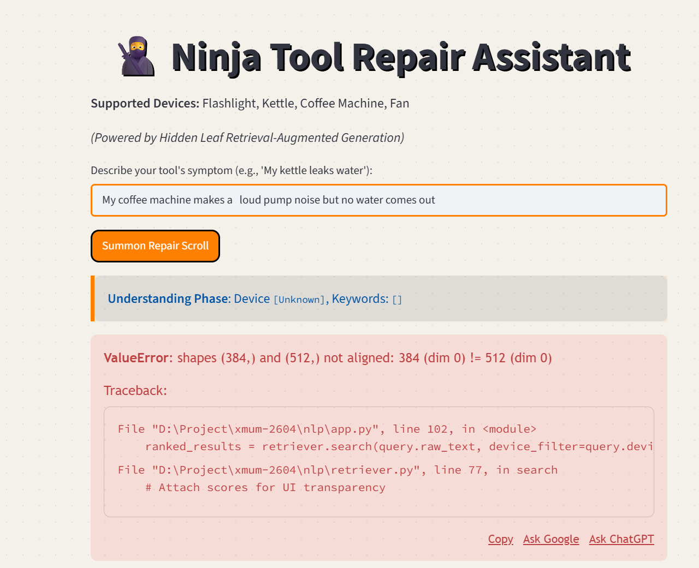

# Cyber-Repair-Manual
[ A Hallucination-Free, Fair-Repair Assistant for Home Appliances ]
[ 基于纯本地双阶段检索与动态决策树的家电故障排查助手 ]

## WORLD 1-1: INTRODUCTION (项目背景)
When home appliances break, users often face lost manuals and information asymmetry. General AI models tend to hallucinate, which introduces significant risks in high-voltage appliance repairs.

Cyber-Repair-Manual is a deterministic, offline troubleshooting assistant. It relies strictly on curated instruction manuals and expert repair corpora. It acts as an interactive manual to prevent repair scams without the risks of generative AI hallucinations.

家电发生故障时，纸质说明书常已遗失，消费者因信息不对称易受不良维修服务欺诈。同时，通用大模型在回答维修问题时容易产生幻觉，在涉及强电的场景下具有严重危险。

本项目旨在解决上述问题。系统摒弃黑盒生成，仅基于人工审核的说明书与权威维修语料运行，提供准确、安全的故障排查支持。

## WORLD 1-2: CORE MECHANICS (核心特性)
- ZERO HALLUCINATION (零幻觉机制): Answers are extracted from verified instruction manuals via semantic retrieval.
- ANTI-SCAM & SAFETY PROTOCOL (安全拦截网): Distinguishes between DIY fixes and hardware faults. High-voltage issues trigger a hard stop advising professional repair.
- TWO-STAGE CASCADED RETRIEVAL (双阶段检索): 
  1. Lexical Recall (rank_bm25)
  2. Dense Reranking (sentence-transformers / Cosine Similarity)
- INTERACTIVE DECISION GATE (交互式决策门控): Ambiguous inputs trigger targeted clarification questions based on data-driven decision trees.
- 100% OFFLINE (纯本地运行): Runs entirely locally. No external API dependencies.

## WORLD 2-1: ARCHITECTURE (系统架构)
[Level 0] The Cyber Corpus (语料编译): Manuals structured into a JSONL schema covering symptoms, safety notes, and atomic steps.
[Level 1] Symptom Parser (意图解析): Utilizes jieba to extract target devices and symptom keywords.
[Level 2] Retriever (级联检索): Device Hard Filter -> BM25 Recall -> Dense Embedding Reranking.
[Level 3] Decision Gate (决策门控): Evaluates confidence margin. Low confidence triggers dynamic clarification.
[Level 4] Renderer (输出渲染): Formats retrieved manual entries into structured Markdown output.

## WORLD 2-2: EXECUTIONS (输入输出示例)

[CASE 1: HIGH CONFIDENCE (高置信诊断)]
Input: "The light keeps flickering, sometimes bright sometimes dim"
Output: 
- Diagnosis: Dim or flickering (Severity: DIY Repair)
- Steps: 1. Replace with fully charged batteries... 2. Clean contacts with an alcohol swab...

[CASE 2: SAFETY PROTOCOL TRIGGERED (安全拦截送修)]
Input: "My kettle is leaving a puddle on the table and dripping constantly"
Output: 
- WARNING: Beyond DIY repair. Safety risks involved.
- Notes: Unplug immediately! Water leaking onto the high-voltage base is a severe electrocution hazard!

[CASE 3: CLARIFICATION GATE (决策门控追问)]
Input: "Pump is loud but no coffee comes out"
Internal State: Low confidence margin detected.
System Prompt: "Did the water tank recently run completely dry before this started happening?" (Awaiting Yes/No from user to rerank candidates).

## WORLD 2-3: VISUALS (界面预览)


## WORLD 3-1: START GAME (环境配置)
Requirements: Python 3.10+

1. Clone repository
```bash
git clone https://github.com/Chemit797/Cyber-Repair-Manual.git
cd Cyber-Repair-Manual
```

2. Setup Environment
Windows:
```powershell
.\setup.ps1
```

Mac/Linux:
```bash
python3 -m venv venv
source venv/bin/activate
pip install -r requirements.txt
```

3. Cache Embedding Model
```bash
python -c "from sentence_transformers import SentenceTransformer; SentenceTransformer('all-MiniLM-L6-v2')"
```

## WORLD 3-2: PLAY (运行系统)
Launch Web UI:
```bash
streamlit run app.py
```

Test backend logic via terminal:
```bash
python test_run.py
```

## WORLD 4-1: CREDITS (项目归属)
Developed for the AIT203 Natural Language Processing course group project. The project explores addressing hallucination in generative AI within high-stakes domains via retrieval and symbolic logic.
