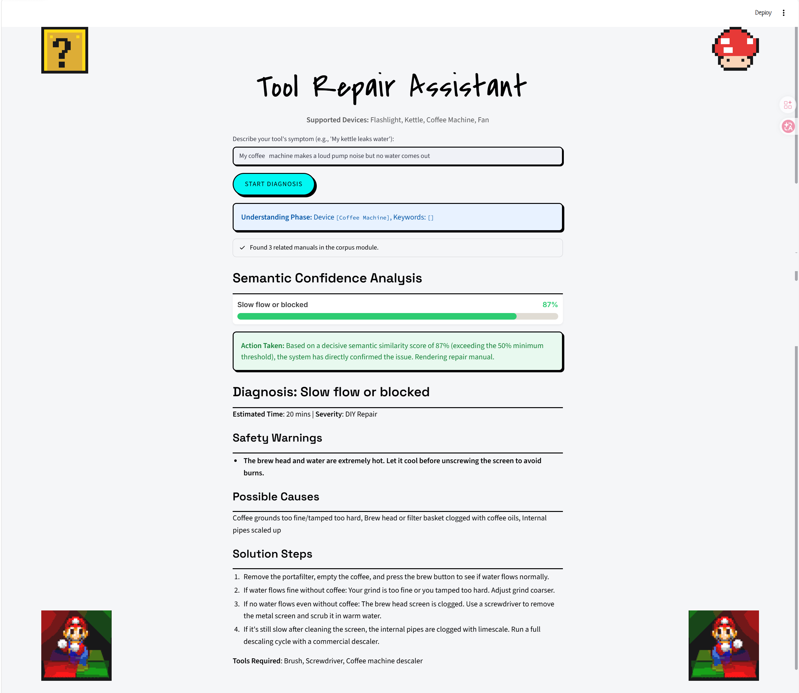

# Cyber-Repair-Manual
[English](README.md) | [中文](README_zh.md)

基于纯本地双阶段检索与动态决策树的家电故障排查助手。

## 项目背景
家电发生故障时，纸质说明书常已遗失，消费者因信息不对称易受不良维修服务欺诈。同时，通用大模型在回答维修问题时容易产生幻觉，在涉及强电的场景下具有严重危险。

本项目旨在解决上述问题。Cyber-Repair-Manual 摒弃黑盒生成，仅基于人工审核的说明书与权威维修语料运行，提供准确、安全的交互式故障排查支持，消除幻觉风险与维修信息差。

## 核心特性
- **零幻觉机制**：所有回答均通过语义检索从既定的真实官方说明书中提取。
- **安全拦截网**：系统自动识别轻微 DIY 故障与严重硬件故障。高压电或拆解隐患将阻断普通步骤并输出专业送修警告。
- **双阶段检索**： 
  1. 词汇级召回 (`rank_bm25`)
  2. 深层语义重排 (`TF-IDF` 余弦相似度)
- **交互式决策门控**：当用户输入存在歧义时，触发数据驱动的决策树，主动发起针对性追问。
- **纯本地运行**：100% 本地计算，无需外部 API 依赖。

## 系统架构
- **阶段 0 - 语料编译**：将家电说明书结构化为 JSONL schema，包含症状、安全警告与原子化步骤。
- **阶段 1 - 意图解析**：基于 `jieba` 提取用户输入中的设备实体与症状特征词。
- **阶段 2 - 级联检索**：设备硬过滤 -> BM25 召回 -> 句向量重排。
- **阶段 3 - 决策门控**：计算置信度。置信度不足时调取候选问题进行追问。
- **阶段 4 - 输出渲染**：将检索到底层 JSON 数据转化为结构化 Markdown 指南。

## 界面预览


## 输入输出示例

**[情形 1：高置信诊断]**
- 用户输入："The light keeps flickering, sometimes bright sometimes dim"
- 系统输出：
  - 诊断：Dim or flickering (DIY Repair)
  - 步骤：1. 检查电池... 2. 用酒精棉签清洁接触点...

**[情形 2：安全拦截送修]**
- 用户输入："My kettle is leaving a puddle on the table and dripping constantly"
- 系统输出：
  - 警告：超出 DIY 范围，涉及安全风险。
  - 注意：请立即断电！水漏入高压底座存在严重的触电危险！

**[情形 3：决策门控追问]**
- 用户输入："Pump is loud but no coffee comes out"
- 内部状态：检测到低置信度（多方案分差过小）。
- 系统追问："请问在出现该问题前，水箱是否被完全抽干过？"（等待用户输入 Yes/No 以重排结果）。

## 环境配置

**运行要求**：Python 3.10+

**1. 获取代码**
```bash
git clone https://github.com/Chemit797/Cyber-Repair-Manual.git
cd Cyber-Repair-Manual
```

**2. 安装依赖**

Windows 环境：
```powershell
.\setup.ps1
```

Mac/Linux 环境：
```bash
python3 -m venv venv
source venv/bin/activate
pip install -r requirements.txt
```

**3. 缓存预训练模型**
为了保证完全离线运行，请先执行以下命令缓存模型：
```bash
python -c "from sentence_transformers import SentenceTransformer; SentenceTransformer('all-MiniLM-L6-v2')"
```

## 运行系统
启动图形界面（Streamlit UI）：
```bash
streamlit run app.py
```

终端后端逻辑测试：
```bash
python test_run.py
```

## 项目归属
本项目为 AIT203 Natural Language Processing 课程团队项目。探索了在约束硬件条件下，通过检索与符号逻辑解决高风险领域中生成式 AI 的幻觉问题。
